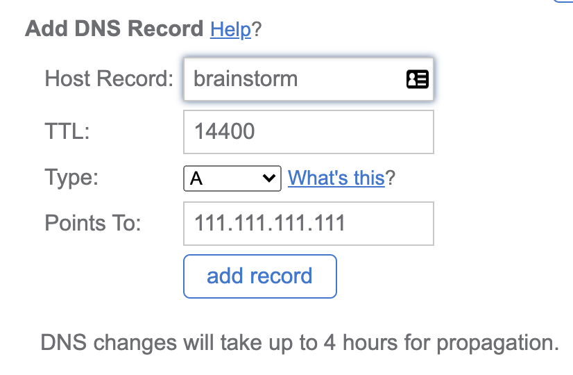

# Engram

engram - a hypothetical permanent change in the brain accounting for the existence of memory; a memory trace.

A MongoDB, Express, React, Node (MERN) stack application for quickly gathering thoughts.

# Table of Contents

- [Installation](#installation)
  - [Local Development](#local-development)
  - [Self Hosted](#self-hosted)
- [Configuration](#configuration)
  - [Environment Variables](#environment-variables)
  - [Sample .env File](#sample-env-file)

# Installation

## Local Development

1. Install [nvm](https://github.com/nvm-sh/nvm#installing-and-updating)
2. Install [Node.js using nvm](https://github.com/nvm-sh/nvm#usage)
3. Create `.env` file with desired [configuration](#configuration)
4. Build and serve React App
    ```
    npm install --prefix fe/
    npm start --prefix fe/
    ```
5. Run API
    ```
    cd be/
    node index.js
    ```

## Self Hosted

1. Spin up a server on your preferred hosting provider
2. Install [nvm](https://github.com/nvm-sh/nvm#installing-and-updating)
3. Install [Node.js using nvm](https://github.com/nvm-sh/nvm#usage)
4. Create `.env` file with desired [configuration](#configuration)
5. Build Production React App
    ```
    npm install --prefix fe/
    npm build --prefix fe/
    ```
6. Install [PM2](https://github.com/Unitech/pm2#installing-pm2)
7. Start API With PM2
    ```
    cd be/
    pm2 start index.js
    ```
8. [Install Nginx](https://www.digitalocean.com/community/tutorials/how-to-install-nginx-on-ubuntu-18-04)
    ```
    sudo apt update
    sudo apt install nginx
    ```
9. Configure Nginx to route traffic to the API and public files
    
    ```
    cd /etc/nginx/sites-available
    ```

    Using your preferred editor create a file `example.com`.

    e.g. `sudo nano example.com`

    Paste the following inside (update the server_name and alias to match what yours actually is)

    ```
    upstream api {
      server 127.0.0.1:4000;
    }

    server {
      server_name example.com;

      listen 80;

      location /api {
        proxy_pass http://api;
      }

      location / {
        alias /home/[user]/brainstorm/fe/build/;
      }
    }
    ```
10. Create a symlink to your new site
    ```
    sudo ln -s /etc/nginx/sites-available/example.com /etc/nginx/sites-enabled/
    ```
11. Reload Nginx
    ```
    sudo service nginx reload
    ```
12. Add a A DNS record that points to the IP address of this server
    
    On Bluehost, this can be found under the **domains** heading and **zone editor** subheading

    

# Configuration

Secrets and configuration are managed in be/.env and loaded using the [dotenv](https://github.com/motdotla/dotenv) library.

## Environment Variables

- DB_URL - [MongoDB connection string](https://docs.mongodb.com/manual/reference/connection-string/)
- PORT - Port to run API on (Default: 4000)

## Sample .env File

```
DB_URL=mongodb://mongodb0.example.com:27017
```
